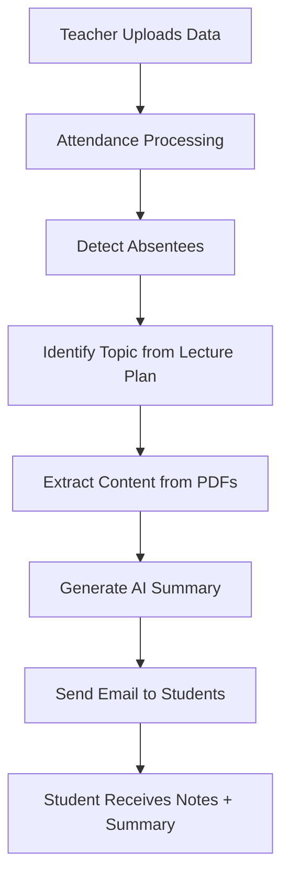
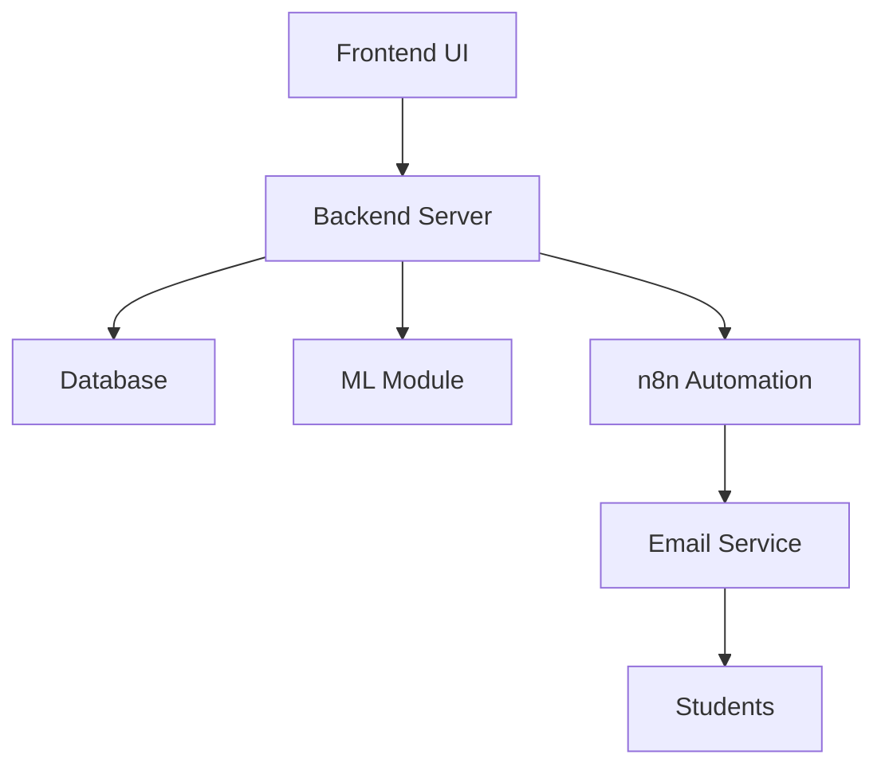

# 🚀 MISSED CLASS RECOVERY ENGINE (AI + AUTOMATION)

> ⚡ An intelligent system that detects absent students and automatically delivers personalized learning recovery using AI and workflow automation.

---

# 🧠 SYSTEM IN ONE VIEW (MASTER FLOW)



---

# 🎯 CORE IDEA

A system that ensures:

✔ No student misses learning  
✔ Automatic recovery of missed lectures  
✔ AI-generated summaries + notes  
✔ Zero manual follow-up by teachers  

---

# 🧩 COMPLETE SYSTEM BREAKDOWN

## 👨‍🏫 1. TEACHER / ADMIN SIDE

- Create subjects (DBMS, OS, etc.)
- Upload:
  - 📘 Study Materials (PDF / PPT)
  - 📅 Lecture Plan (Date → Topic)
  - 👨‍🎓 Student Data (Excel)
- Mark or upload attendance

---

## 📝 2. ATTENDANCE SYSTEM

```text
Input → Attendance Sheet
Process → Detect "Absent"
Output → Absentee List
```

✔ Manual mode (checkbox)  
✔ File upload (Excel/PDF)  

---

## 🧠 3. AI + ML ENGINE

### 🔍 What it does:

- Extracts headings/topics from PDFs  
- Maps lecture plan → actual content  
- Identifies what was taught today  
- Generates student-friendly summary  

### 🤖 AI Usage:

- LLM → Summary generation  
- NLP → Topic extraction  
- (Optional) ML → Priority classification  

---

## 🔗 4. AUTOMATION (n8n WORKFLOW)


---

## 📧 5. OUTPUT SYSTEM (MAIN FEATURE)

### 📩 Student Receives:

- Subject name  
- Topic covered  
- AI-generated summary  
- PDF notes / resources  

---

# ⚙️ FULL SYSTEM ARCHITECTURE



---

# 📦 PROJECT STRUCTURE

```
missed-class-recovery/
│
├── frontend/        → UI (React / Streamlit)
├── backend/         → APIs (Node.js / Django)
├── ml-module/       → AI/NLP logic
├── workflows/       → n8n automation
├── data/            → Excel datasets
├── docs/            → PPT & diagrams
└── README.md
```

---

# 🔄 END-TO-END EXECUTION FLOW

```text
1. Teacher uploads lecture plan & materials
2. Teacher uploads attendance
3. System detects absentees
4. System maps topic (based on date)
5. AI generates summary
6. Email sent automatically
```

---

# 🧪 TECH STACK

### 🌐 Frontend
- React / Streamlit

### ⚙️ Backend
- Node.js / Django

### 🧠 AI / ML
- Python
- OpenAI API
- pdfplumber / PyMuPDF

### 🔄 Automation
- n8n

### 🗄️ Database
- MongoDB / PostgreSQL

### 📧 Email
- SMTP / Gmail API

---

# 📂 INPUT FORMATS

### 👨‍🎓 Student Data
| Name | Reg No | Email | Phone |

### 📝 Attendance
| Reg No | Status |

### 📅 Lecture Plan
| Date | Topic |

---

# ✉️ SAMPLE OUTPUT

```text
Subject: Missed Class Recovery - OS

Hi [Student Name],

You were absent for today's class.

Topic Covered:
Memory Management

Summary:
[AI Generated Summary]

Please review the attached material.

Regards,
Recovery System
```

---

# 🚀 FUTURE SCOPE

- WhatsApp Notifications  
- AI Chatbot for Doubts  
- Personalized Study Plans  
- Face Recognition Attendance  
- Smart Performance Tracking  

---

# 🧠 VIVA LINE (REMEMBER THIS)

> “This system combines attendance tracking, document intelligence, and AI-driven summarization to automate academic recovery for absent students.”

---

# 👨‍💻 AUTHOR

**Shriyash Sahu**  
B.Tech | AI & ML Enthusiast  

---

# ⭐ FINAL NOTE

This project demonstrates:
- Real-world system design  
- AI + automation integration  
- Practical problem solving in education  
│   ├── Absentee Reports
│   ├── Download Data
│   └── Teacher Insights
│
└── 🔐 Developer Module
├── Admin Login
├── Workflow Monitoring
└── API Integration

```

---

## 📌 Overview

The **Missed Class Recovery System** is an AI-powered web application that helps students recover missed lectures automatically.

When a student is marked absent:
- The system detects the missed lecture
- Identifies the topic taught
- Generates a summary using AI
- Sends an email with notes and resources

---

## 🎯 Objective

To automate the academic recovery process for absent students using:
- Attendance tracking
- Document intelligence
- AI-based summarization
- Workflow automation

---

## ⚙️ System Architecture

```

Teacher/Admin Portal
↓
Upload Data (PDF, Excel, Lecture Plan)
↓
Attendance Processing
↓
Absentee Detection
↓
Topic Mapping Engine
↓
AI Summary Generator
↓
Email Automation System
↓
Student Notification

```

---

## 🔄 End-to-End Workflow

```

1. Teacher uploads lecture plan & study materials
2. Teacher uploads or marks attendance
3. System detects absent students
4. System identifies topic taught (based on date)
5. AI generates summary of topic
6. Email is sent to absentees with:

   * Topic name
   * Summary
   * Notes/PDF

```

---

## 🔗 n8n Automation Workflow

```

Webhook Trigger (Attendance Submitted)
↓
Read Attendance Data (Excel/Google Sheets)
↓
Filter Absentees (IF Node)
↓
Fetch Topic (Lecture Plan Mapping)
↓
OpenAI Node (Generate Summary)
↓
Send Email (Gmail/SMTP)

```

---

## 🧩 Core Modules

### 1. Admin / Teacher Portal
- Upload study materials (PDF/PPT)
- Upload lecture plan
- Upload student data
- Manage subjects

---

### 2. Attendance Management
- Manual marking (Present/Absent)
- File upload (Excel/PDF)
- Automatic absentee detection

---

### 3. AI / ML Module
- Extract topics from PDFs
- Map lecture plan to content
- Generate summaries using LLM
- (Optional) ML-based priority classification

---

### 4. Notification System
- Sends automated emails to absent students
- Includes summary and study materials

---

### 5. Analytics Dashboard
- View absentee list
- Download reports
- Track attendance trends

---

## 🗂️ Project Structure

```

missed-class-recovery/
│
├── frontend/          # UI (React / HTML / Streamlit)
├── backend/           # API (Node.js / Django)
├── ml-module/         # NLP & ML scripts (Python)
├── workflows/         # n8n automation workflows
├── data/              # Sample datasets (Excel)
├── docs/              # PPT & diagrams
└── README.md

```

---

## 🧪 Tech Stack

### Frontend
- React.js / Streamlit

### Backend
- Node.js / Express OR Django

### AI / ML
- Python
- OpenAI API (for summaries)
- pdfplumber / PyMuPDF

### Automation
- n8n (workflow orchestration)

### Database
- MongoDB / PostgreSQL

### Email
- SMTP / Gmail API / SendGrid

---

## 📂 Input Formats

### Student Data (Excel)
| Name | Reg No | Email | Phone |

### Attendance Sheet
| Reg No | Status |
|--------|--------|
| 101    | Present |
| 102    | Absent  |

### Lecture Plan
| Date       | Topic              |
|------------|-------------------|
| 2026-03-23 | Memory Management |

---

## ✉️ Sample Email Output

```

Subject: Missed Class Recovery - OS

Dear Student,

You were absent for today's class.

Topic Covered:
Memory Management

Summary:
[AI Generated Summary]

Please review the attached material.

Regards,
Recovery System

```

---

## 🚀 Future Enhancements

- WhatsApp Notifications
- AI Chatbot for Doubts
- Personalized Learning Paths
- Face Recognition Attendance
- Performance Prediction System

---

## 🧠 Key Learning Outcomes

- Full-stack development
- AI integration in real systems
- Workflow automation using n8n
- NLP for document processing
- System design & architecture

---

## 👨‍💻 Author

**Shriyash Sahu**  
B.Tech | AI & ML Enthusiast

---

## 📜 License

For academic and educational use only.

---
```

---

