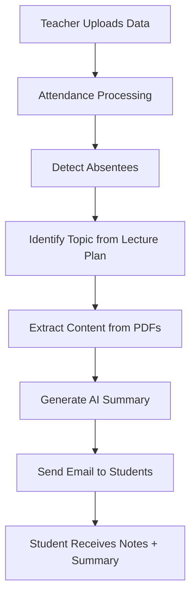
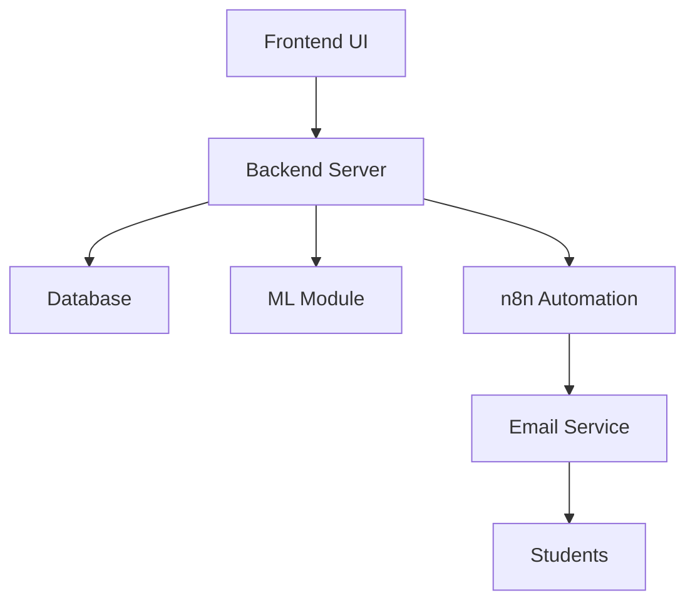

# 🚀 MISSED CLASS RECOVERY ENGINE (AI + AUTOMATION)

> ⚡ An intelligent system that detects absent students and automatically delivers personalized learning recovery using AI and workflow automation.

---

# 🧠 SYSTEM IN ONE VIEW (MASTER FLOW)



---

# 🎯 CORE IDEA

A system that ensures:

✔ No student misses learning  
✔ Automatic recovery of missed lectures  
✔ AI-generated summaries + notes  
✔ Zero manual follow-up by teachers  

---

# 🧩 COMPLETE SYSTEM BREAKDOWN

## 👨‍🏫 1. TEACHER / ADMIN SIDE

- Create subjects (DBMS, OS, etc.)
- Upload:
  - 📘 Study Materials (PDF / PPT)
  - 📅 Lecture Plan (Date → Topic)
  - 👨‍🎓 Student Data (Excel)
- Mark or upload attendance

---

## 📝 2. ATTENDANCE SYSTEM

```text
Input → Attendance Sheet
Process → Detect "Absent"
Output → Absentee List
```

✔ Manual mode (checkbox)  
✔ File upload (Excel/PDF)  

---

## 🧠 3. AI + ML ENGINE

### 🔍 What it does:

- Extracts headings/topics from PDFs  
- Maps lecture plan → actual content  
- Identifies what was taught today  
- Generates student-friendly summary  

### 🤖 AI Usage:

- LLM → Summary generation  
- NLP → Topic extraction  
- (Optional) ML → Priority classification  

---

## 🔗 4. AUTOMATION (n8n WORKFLOW)


---

## 📧 5. OUTPUT SYSTEM (MAIN FEATURE)

### 📩 Student Receives:

- Subject name  
- Topic covered  
- AI-generated summary  
- PDF notes / resources  

---

# ⚙️ FULL SYSTEM ARCHITECTURE



---

# 📦 PROJECT STRUCTURE

```
missed-class-recovery/
│
├── frontend/        → UI (React / Streamlit)
├── backend/         → APIs (Node.js / Django)
├── ml-module/       → AI/NLP logic
├── workflows/       → n8n automation
├── data/            → Excel datasets
├── docs/            → PPT & diagrams
└── README.md
```

---

# 🔄 END-TO-END EXECUTION FLOW

```text
1. Teacher uploads lecture plan & materials
2. Teacher uploads attendance
3. System detects absentees
4. System maps topic (based on date)
5. AI generates summary
6. Email sent automatically
```

---

# 🧪 TECH STACK

### 🌐 Frontend
- React / Streamlit

### ⚙️ Backend
- Node.js / Django

### 🧠 AI / ML
- Python
- OpenAI API
- pdfplumber / PyMuPDF

### 🔄 Automation
- n8n

### 🗄️ Database
- MongoDB / PostgreSQL

### 📧 Email
- SMTP / Gmail API

---

# 📂 INPUT FORMATS

### 👨‍🎓 Student Data
| Name | Reg No | Email | Phone |

### 📝 Attendance
| Reg No | Status |

### 📅 Lecture Plan
| Date | Topic |

---

# ✉️ SAMPLE OUTPUT

```text
Subject: Missed Class Recovery - OS

Hi [Student Name],

You were absent for today's class.

Topic Covered:
Memory Management

Summary:
[AI Generated Summary]

Please review the attached material.

Regards,
Recovery System
```

---

# 🚀 FUTURE SCOPE

- WhatsApp Notifications  
- AI Chatbot for Doubts  
- Personalized Study Plans  
- Face Recognition Attendance  
- Smart Performance Tracking  

---

# 🧠 VIVA LINE (REMEMBER THIS)

> “This system combines attendance tracking, document intelligence, and AI-driven summarization to automate academic recovery for absent students.”

---

# 👨‍💻 AUTHOR

**Shriyash Sahu**  
B.Tech | AI & ML Enthusiast  

---

# ⭐ FINAL NOTE

This project demonstrates:
- Real-world system design  
- AI + automation integration  
- Practical problem solving in education  
│   ├── Absentee Reports
│   ├── Download Data
│   └── Teacher Insights
│
└── 🔐 Developer Module
├── Admin Login
├── Workflow Monitoring
└── API Integration

```

